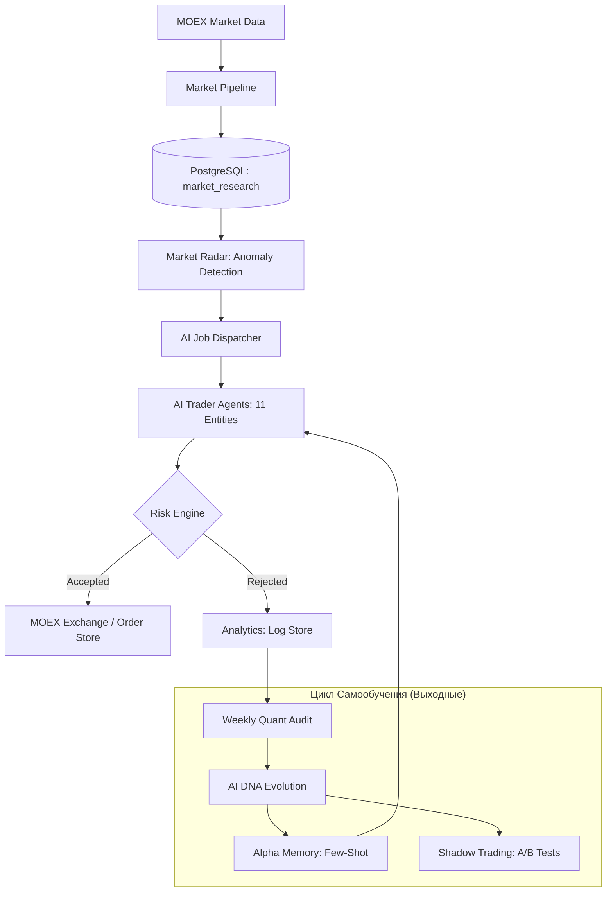

# Архитектура Торговой Системы v0.8.0

## 🌍 Обзор системы
Торговая лига представляет собой многоагентную самообучающуюся систему, построенную на базе LLM (Gemini) и детерминированных риск-алгоритмов.

## 🛠 Ключевые компоненты

### 1. Интеллектуальный слой (AI Core)
*   **Structured Outputs**: Все ответы ИИ валидируются через JSON-схемы.
*   **Fallback Chain**: Многоуровневое резервирование моделей (Pro -> Flash -> Lite).
*   **Alpha Memory**: Коллективная память лучших сделок (Qdrant), используемая для Few-shot обучения в реальном времени.

### 2. Защитный слой (Risk & Safety)
*   **Smart Limits**: Учет только реально исполненных и активных ордеров.
*   **Market Radar**: "Боковое зрение" системы, обнаруживающее аномалии объема и цены.
*   **Financial Precision**: Все расчеты ведутся в типе `Decimal` для исключения ошибок округления.

### 3. Эволюционный цикл (Post-market)
*   **Shadow Trading**: Запуск виртуальных клонов для тестирования экспериментальных DNA.
*   **EOD Cleanup**: Автоматическая очистка "зомби-ордеров" в конце дня.
*   **Daily Snapshots**: Фиксация эквити для точного расчета просадок и рейтинга.

## 📊 Мониторинг и Отчетность
*   **Daily Batch Reports**: ИИ-анализ итогов дня с 10-минутными таймаутами.
*   **Deterministic Analytics**: Объективные отчеты по логам без участия ИИ.
*   **SRE Telegram Bot**: Уведомления о здоровье БД и техническом статусе системы.
