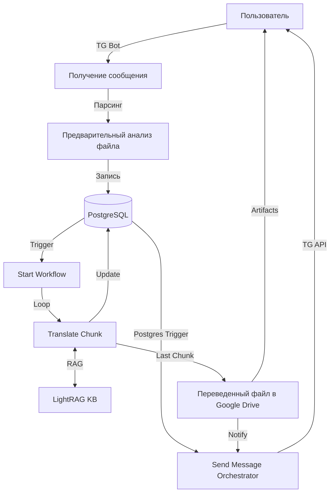

# Полная архитектура системы перевода новелл (Novel Translation Pipeline)

Этот документ описывает полный жизненный цикл данных и взаимодействие компонентов системы.

## 1. Общая архитектурная схема

## 2. Жизненный цикл задачи (Status Flow)

1. **`pending`**: Файл получен, разбит на чанки в `document_chunks`, метаданные в `document_jobs`.
2. **`processing`**: Воркфлоу `Start` инициализировал задачу. Воркфлоу `Translate Chunk` обрабатывает чанки один за другим.
3. **`paused`**: Остановка из-за ошибки (через `[Перевод] Обработка ошибки`) или ручная пауза.
4. **`done`**: Все чанки переведены (`status='done'` в `document_chunks`), файл собран и загружен на Google Drive.

## 3. Подробное описание компонентов

### А. Входящий конвейер (Ingestion)
- **Получение сообщения** (`CHSGtgO88LgGVbV8`): Слушает Telegram Webhook. Сохраняет документ в таблицу `telegram_messages`.
- **Предварительный анализ** (`lSuNRX0VILP9Lgit5VKlK`):
    - Конвертирует DOCX в текст.
    - Идентифицирует главы и записывает в `document_chapters`.
    - Разбивает текст на чанки по ~200 предложений.
    - Инициализирует запись в `document_jobs`.

### Б. Ядро перевода (Translation Core)
- **Start** (`9cjeUNeTZX3YnO1W57YTP`): Проверяет баланс (Polza/Neuro), устанавливает `status='processing'`.
- **Translate Chunk** (`Q5TRHGg-XRblnMRpH41Ee`):
    - Берет первый непереведенный чанк.
    - Запрашивает контекст у **LightRAG** (`sub_lightrag_api`) о персонажах и локациях.
    - Читает Rolling Summary предыдущей главы.
    - Отправляет промпт в LLM.
    - Сохраняет результат в БД и обновляет Rolling Summary.

### В. Система уведомлений (Notification Service)
- **Send Message** (`J62UViXZMD5o6qoU`):
    - Подписан на таблицу `telegram_send_message`.
    - При появлении записи выбирает нужный шаблон (`create_job`, `processing`, `finish`, `error`).
    - Формирует красивое сообщение с прогресс-баром и стоимостью.
    - Отправляет пользователю через Telegram.

### Г. Выходной конвейер (Delivery)
- **Переведенный файл в Google Drive** (`KebWQcS1WmNtgdgA`):
    - Склеивает все переведенные чанки из `document_chunks` в один файл.
    - Создает папку на Google Drive с именем книги и датой.
    - Загружает файл и расшаривает его (Anyone with link can view).
    - Обновляет ссылку в `document_jobs` и инициирует финальное уведомление.

## 4. Спецификация Базы Данных (PostgreSQL)

- **`document_jobs`**: Основная таблица заданий. Поля: `status`, `translated_file`, `billing_polza`, `billing_neuro`, `web_view_link`.
- **`document_chunks`**: Таблица фрагментов. Поля: `chunk_text`, `result_text`, `chunk_index`, `chapter`.
- **`document_chapters`**: Метаданные глав. Поля: `chapter_number`, `summary`, `roller_summary`.
- **`document_log`**: Технический лог каждой ноды.
- **`telegram_send_message`**: Очередь для уведомлений.

## 5. Вспомогательные сервисы
- **Аннотация** (`2kztTVutdATd1MDS`): Генерирует рекламный пост для Telegram и обложку через Flux на основе данных из RAG.
- **Создание Глоссария** (`t8Dmavjx9KS5Ms3SB3Qdj`): Экспортирует найденных персонажей в XLSX.
