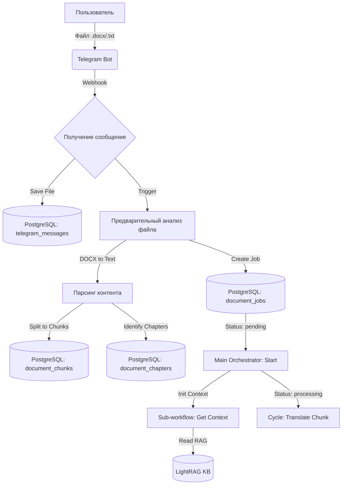

# Схема инициализации перевода (Novel Translation Pipeline)

Этот документ описывает процесс от получения файла пользователем до начала циклической обработки чанков.

## 1. Архитектурная схема (Flow)

## 2. Ключевые этапы инициализации

### Этап А: Прием и хранение
1. **Telegram Trigger**: Воркфлоу `Получение сообщения` (ID: `CHSGtgO88LgGVbV8`) ловит файл.
2. **DB Logging**: Метаданные сообщения сохраняются в таблицу `telegram_messages`. Файл скачивается и сохраняется как бинарный объект.

### Этап Б: Анализ и структурирование
1. **Workflow**: `Предварительный анализ файла для перевода` (ID: `lSuNRX0VILP9Lgit5VKlK`).
2. **Конвертация**: Нода `DOCX to Text` извлекает сырой текст.
3. **Сегментация**: Текст разбивается на чанки (обычно по 200 предложений или по размеру токенов).
4. **БД**: 
   - Создается запись в `document_jobs` (статус `pending`).
   - Все чанки записываются в `document_chunks` с привязкой к `job_id`.
   - Если найдены заголовки глав, они фиксируются в `document_chapters`.

### Этап В: Запуск процесса
1. **Start Workflow**: Воркфлоу `Start` (ID: `9cjeUNeTZX3YnO1W57YTP`) переводит задачу в статус `processing`.
2. **Оркестрация**: Вызывается под-воркфлоу `Translate Chunk` (ID: `Q5TRHGg-XRblnMRpH41Ee`), который начинает последовательную обработку чанков с учетом глоссария и контекста из LightRAG.

## 3. Таблицы базы данных
- **document_jobs**: Мастер-запись процесса (файл, статус, ссылки на результат).
- **document_chunks**: Очередь на перевод (оригинал, результат, статус чанка).
- **document_chapters**: Карта глав для навигации и Rolling Summary.
